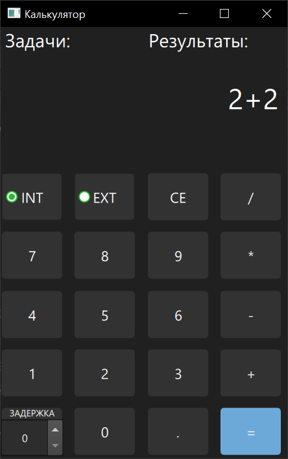

# Test task

-------------------------------
Сборка библиотеки и проекта под
Desktop_Qt_6_6_2_shared_MinGW_w64_MINGW64_MSYS2

-------------------------------

-------------------------------
INT и EXT - выбор библиотек, внутренняя и внешняя(dll) соответственно.